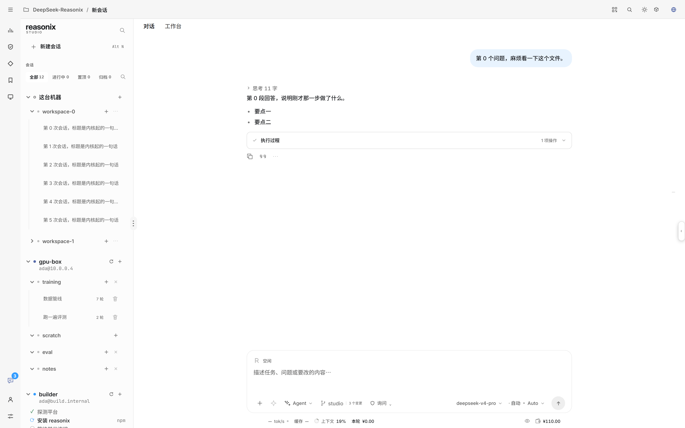
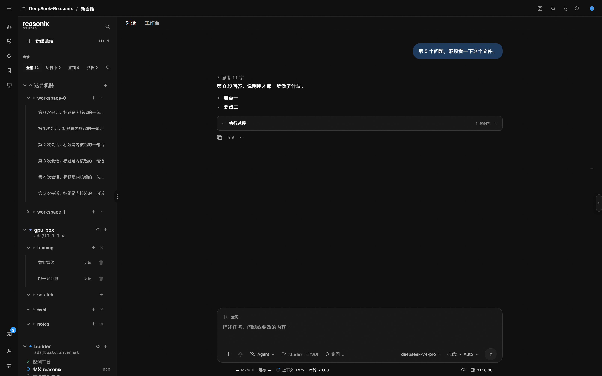

# reasonix-skin

给 [Reasonix Studio](https://github.com/esengine/DeepSeek-Reasonix) 换皮的皮肤 / 覆盖层工作区。

当前只有一套：**Codex Ink** —— 把 Studio 换成 Codex 桌面端的观感（零彩色 chrome、墨白灰阶即层级、最左一条图标轨、通栏灰壳顶栏）。





## 快速上手

```powershell
git clone https://github.com/f1shsmell/reasonix-skin
cd reasonix-skin/codex-ink

# 路线一：CSS 覆盖层（外观恒定、能力最全；Studio 每次升级后重跑一次）
pwsh -File install.ps1

# 路线二：官方主题包（纯官方机制，Studio 2.29+）
reasonix plugin install .\theme-pack --link --yes
```

`install.ps1 -Restore` 或 `uninstall.ps1` 可还原。

## 目录

| 路径 | 内容 |
| --- | --- |
| `codex-ink/` | Codex Ink 正本：`codex-ink.css`、`install.ps1` / `uninstall.ps1`、`theme-pack/`、`preview/`、`tools/` |
| `codex-ink/README.md` | **完整文档**——为什么走覆盖层而不是插件、2.29 的 token 白名单实测、覆盖层逐项做了什么、复核脚本用法 |

路由、token 能力边界、逐条改动与复核方法都写在那份文档里，这里不重复。

## 许可

MIT，见 [LICENSE](LICENSE)。色值取自 Codex 实机截图逐像素测量（经社区插件 [`rindbeans/codex-ui`](https://github.com/rinDBeans/codex-ui)，MIT）。
